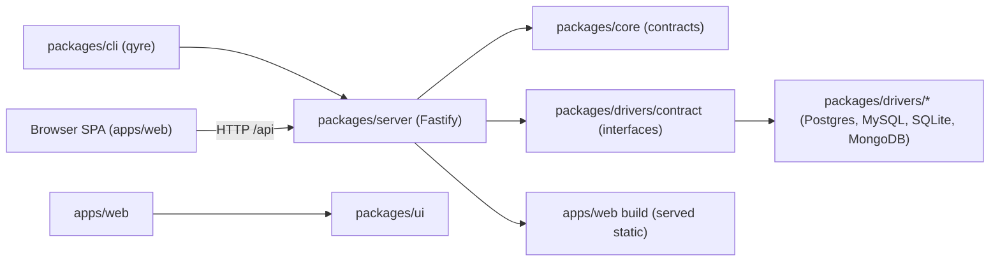

# ARCHITECTURE.md

Top-level map of the Qyre system. Keep this concise and point to deeper docs when needed.

## System shape

- Product: Qyre, a local-first database management UI launched from the CLI for any database engine.
- Primary user workflow: `npx qyre <database-url>` -> engine auto-detected from the target -> local
  server -> browser UI -> inspect database.
- Runtime surfaces: CLI, local HTTP server, browser SPA.
- Source of truth for product behavior: [`docs/product-specs/`](docs/product-specs/).

## Runtime flow

## Domain map

| Domain     | Purpose                                                  | Primary entry points                                      | Related spec                                         |
| ---------- | -------------------------------------------------------- | --------------------------------------------------------- | ---------------------------------------------------- |
| CLI        | Parse target, start server, open browser, clean shutdown | `packages/cli/src/index.ts`                               | `docs/product-specs/connect-and-inspect-postgres.md` |
| Server     | Local HTTP API, health, static UI serving                | `packages/server/src/` (`app.ts`, `routes/`, `services/`) | `packages/server/STRUCTURE.md`                       |
| Core       | Shared domain types, validation, and contracts           | `packages/core/src/` (`types/`, `validation/`)            | same                                                 |
| DB drivers | Engine-agnostic interface + concrete engine drivers      | `packages/drivers/contract`, `packages/drivers/<engine>`  | same                                                 |
| Web UI     | Browser interface for inspection                         | `apps/web/src/`                                           | `apps/web/STRUCTURE.md`                              |
| UI kit     | Reusable presentation components                         | `packages/ui/src/`                                        | `FRONTEND.md`                                        |

## Folder organization

Code is organized by cohesive responsibility; exact folder names follow actual ownership and
dependencies rather than a prescribed taxonomy. Tests mirror the chosen source organization under
each package's `tests/` tree. See [`docs/CODE_ORGANIZATION.md`](docs/CODE_ORGANIZATION.md). Package
`index.ts` files expose public APIs only; they do not define behavior.

## Layer model

Use a fixed directional model so agents do not invent ad hoc architecture:

`Types (core) -> Driver contract (drivers/contract) -> Driver impls (drivers/*) -> Server -> CLI`
and separately `UI kit (ui) -> Web app (apps/web)`. `ui` may depend on `core` for shared domain types
(e.g. `ConnectionStatus`) so the same type isn't hand-duplicated in both places - see
`docs/CODE_ORGANIZATION.md`.

The browser talks to the server only over the local HTTP API. The web app never imports server or
driver packages directly.

## Hard dependency rules

- Lower layers must not depend on higher layers.
- `packages/core` must not depend on server, CLI, drivers, or UI.
- `packages/drivers/contract` defines interfaces; it must not depend on a concrete engine.
- `packages/drivers/postgres` (and future `packages/drivers/<engine>`) depends on
  `driver-contract` and `core` only.
- `packages/server` may depend on `core`, `driver-contract`, and concrete driver packages.
- `packages/cli` depends on `server` (and `core`); it must not talk to drivers directly.
- `apps/web` depends on `ui` and `core` types only; all data access goes through the HTTP API.
- New database engines are added as new `packages/drivers/<engine>` packages, never by branching
  inside existing packages on engine type.

## Adding a new database engine

Postgres is the first supported engine, not the only one the architecture allows. Every additional
engine follows the same recipe:

1. Create `packages/drivers/<engine>` implementing the `DatabaseAdapter` contract from
   `@qyre/driver-contract`.
2. Implement `getCapabilities()` and per-table permissions. Introspection drives affordances but
   must fail closed; the database remains authoritative.
3. Add only the optional capability namespaces the engine genuinely supports: `mutations` for
   structured row/document writes, `ddl` for schema objects, and `admin` for database/access
   operations. An absent namespace means not applicable; grants never change contract shape.
4. Classify the engine's stable native permission-denial codes through
   `classifyPermissionDenied()` so the server can return the shared redacted 403 contract.
5. Register the adapter behind the server's resolution, which detects the engine from the connection
   target (URL scheme, file extension, etc.) rather than requiring the user to name it.
6. Reuse genuinely engine-agnostic logic from `@qyre/driver-contract` (e.g. pagination clamping).
   Do not reuse logic that only looks generic but actually differs per engine (e.g. SQL identifier
   quoting - `"..."` in Postgres, `` `...` `` in MySQL); keep that in the engine's own package.
7. Add a product spec and feature entries, including explicit not-applicable behavior.
8. Add unit/integration tests and shared `@qyre/testing-conformance` cases for reads, capabilities,
   supported write namespaces, denial classification, and restricted access. State every
   not-applicable conformance case explicitly.
9. Add Playwright coverage for connect/inspect plus both writable and read-only role behavior. New
   write controls must remain absent from read-only sessions, and mutating routes must reject both
   unauthenticated and authenticated read-only callers cleanly.
10. If the engine's client library uses a connection pool, attach an error listener to it so a
    dropped connection (DB restart, network blip) degrades to `/api/health` reporting
    `"disconnected"` instead of crashing the whole process - see F007's audit of
    `packages/drivers/postgres`, where a missing `pool.on("error", ...)` listener did exactly that.

This keeps engine-specific logic isolated so adding a database is additive, never a branch inside
existing packages.

## Cross-cutting interfaces

| Concern     | Approved boundary                    | Notes                                                      |
| ----------- | ------------------------------------ | ---------------------------------------------------------- |
| Logging     | server logger (Fastify/pino)         | structured logs only, no ad hoc console in product code    |
| DB access   | `DatabaseAdapter` interface          | UI/server never embed engine-specific SQL outside adapters |
| Config      | `packages/config`                    | shared TS/lint/test/build config                           |
| Validation  | parse at boundaries (e.g. Zod)       | validate untrusted input before use                        |
| Permissions | adapter classifiers + route metadata | advisory UI, authoritative DB, redacted denials            |

## Change checklist

When you touch architecture-relevant code:

1. Update this file if the domain map or boundaries changed.
2. Update the related design doc in [`docs/design-docs/`](docs/design-docs/) if reasoning changed.
3. Add or update an executable check if a rule should be enforced mechanically.
