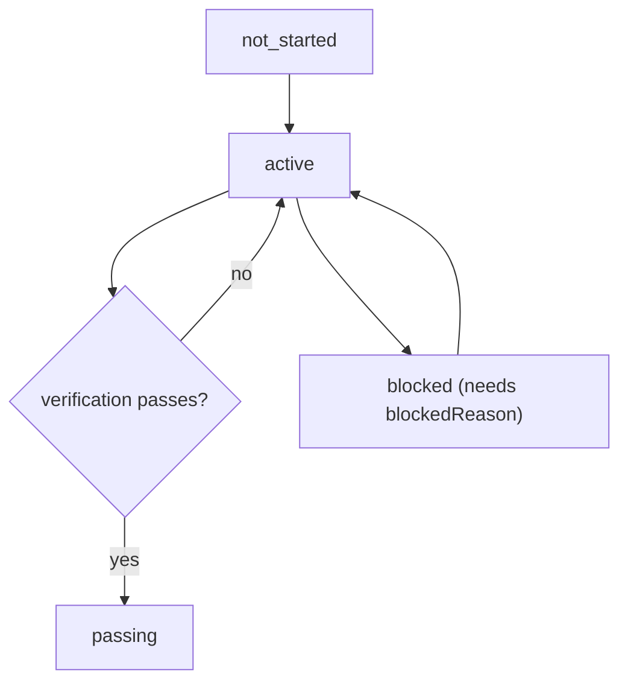

# FEATURES.md

[`FEATURES.json`](FEATURES.json) is the single source of truth for scope. It is not a memo: it is
read when choosing the next feature, judging whether a feature is done, and writing the session
handoff.

## The triple

Every feature entry must have:

- `behavior`: what the user-visible outcome is.
- `verification`: the exact command that proves it works.
- `state`: one of `not_started`, `active`, `blocked`, `passing`.

Plus metadata: `id`, `evidence`, `blockedReason`, `spec`.

## State machine

## Rules (enforced by `scripts/check-features.mjs`)

- IDs are unique and match `F` followed by three digits.
- `state` is one of the allowed states.
- At most one feature is `active` at a time.
- A `passing` feature must have non-empty `evidence` (command output ref, commit SHA, or E2E artifact).
  Once the work is committed, include the commit SHA (and PR link/number if one exists) in
  `evidence` alongside the verification output — not just a prose description — so a fresh agent can
  locate the exact change without re-deriving it.
- A `blocked` feature must have a non-empty `blockedReason`.
- Every feature must have a non-empty `behavior` and `verification`.
- The agent does not flip a feature to `passing` from inspection; it only does so after the
  `verification` command actually passes, and records the evidence.

## Granularity

Each feature should be completable in roughly one session. Too broad will not finish; too narrow is
overhead.

If a requested feature turns out to be too broad once scoped, split it: implement and verify the
first slice, and add the rest as new `not_started` entries rather than trying to push everything
through `active` in one pass (see `docs/PLANS.md`).
