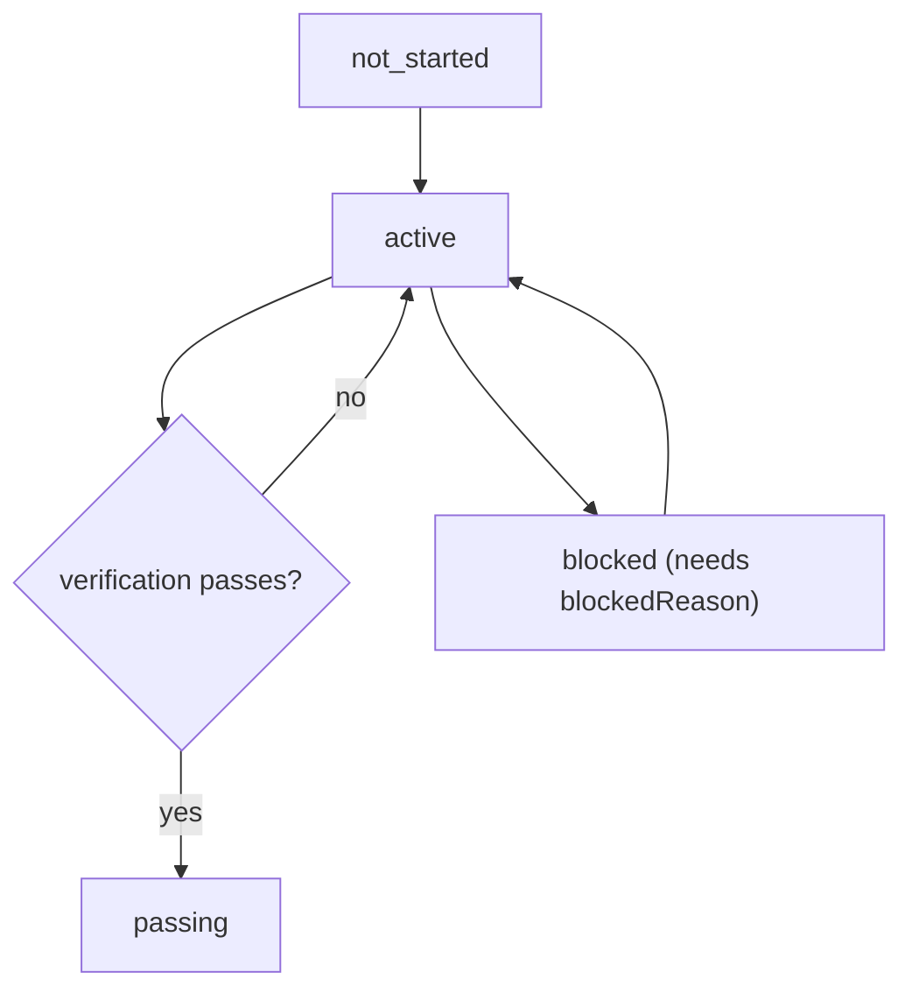

# FEATURES.md

[`FEATURES.json`](FEATURES.json) is the single source of truth for MVP scope. It is a harness
primitive, not a memo: the scheduler (which feature to do next), the verifier (is it done), and the
session-handoff report all read from it.

## The triple

Every feature entry must have:

- `behavior`: what the user-visible outcome is.
- `verification`: the exact command that proves it works.
- `state`: one of `not_started`, `active`, `blocked`, `passing`.

Plus harness metadata: `id`, `evidence`, `blockedReason`, `spec`.

## State machine

## Rules (enforced by `scripts/check-features.mjs`)

- IDs are unique and match `F` followed by three digits.
- `state` is one of the allowed states.
- At most one feature is `active` at a time.
- A `passing` feature must have non-empty `evidence` (command output ref, commit SHA, or E2E artifact).
- A `blocked` feature must have a non-empty `blockedReason`.
- Every feature must have a non-empty `behavior` and `verification`.
- The agent does not flip a feature to `passing` from inspection; it only does so after the
  `verification` command actually passes, and records the evidence.

## Granularity

Each feature should be completable in roughly one session. Too broad will not finish; too narrow is
overhead.
